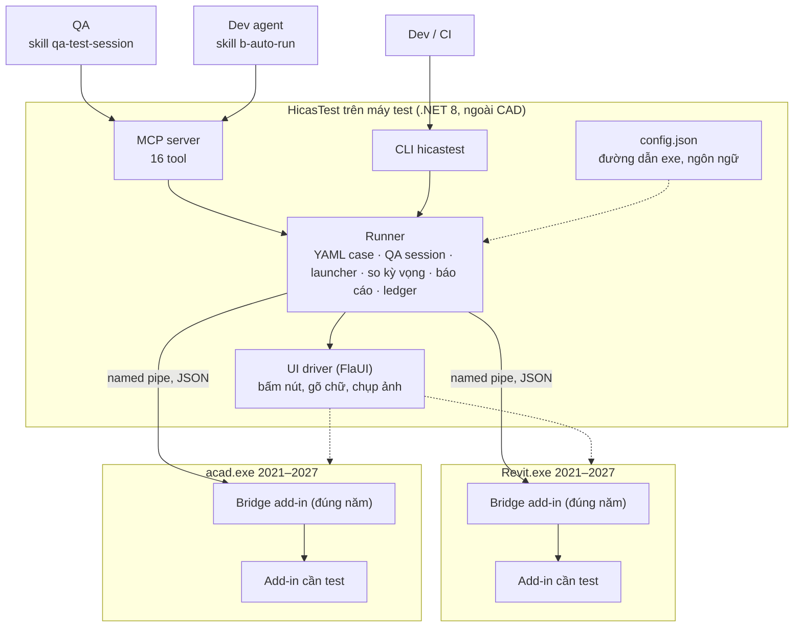

# HicasTest — tool test add-in Revit / AutoCAD

HicasTest giúp **tự động hoá các case test cấp B** của plugin hicas-bimcad (những case trước đây phải có người
mở Revit/AutoCAD để test tay), và cho **QA nhờ Claude điều khiển Revit/AutoCAD test từng bước, có ảnh chụp**.

> **Nguyên tắc quan trọng nhất:** tool **không bao giờ kết luận Pass**. Kết quả của tool là bằng chứng máy
> (`MATCH / MISMATCH / NOT-RUN / ERROR`). Case cấp B vẫn ở trạng thái `Chờ xác nhận — có bằng chứng máy`
> cho đến khi con người xác nhận. Chúng ta đang đo độ chính xác của tool — xem [docs/accuracy-study.md](docs/accuracy-study.md).

**Trạng thái:** v0.1 — đã build và có unit test, **chưa chạy thử trong Revit/AutoCAD thật** (spike đầu tiên đang chờ
một story pilot). Mọi góp ý về kiến trúc nên đưa ra lúc này.

---

## 1. Tool làm được gì

| Ai dùng | Làm gì | Qua đâu |
|---|---|---|
| **Dev agent** (addin-story / addin-batch) | Chạy tự động các case cấp B của một story trên mọi năm Revit/AutoCAD đã cài, xuất báo cáo + ledger | Skill `b-auto-run` → MCP `run_test_case` |
| **QA** | Nói bằng lời "test tính năng X trên Revit 2024, chụp ảnh từng bước" → Claude mở host, chạy lệnh, bấm hộp thoại, chụp ảnh, kiểm giá trị, xuất báo cáo | Skill `qa-test-session` → MCP `qa_session_*` |
| **Dev / CI** | Chạy bộ YAML từ dòng lệnh | `hicastest run …` |

Phiên bản hỗ trợ: **Revit 2021–2027** và **AutoCAD 2021–2027**. Người dùng chọn năm trong từng test case
(`host.version`) hoặc khi chạy (`--host-version 2026`).

| Năm | Runtime | Ghi chú |
|---|---|---|
| 2021–2024 | .NET Framework 4.8 | |
| 2025–2026 | .NET 8 | |
| 2027 | .NET 10 | |

---

## 2. Kiến trúc



**Vì sao chia như vậy**

1. **Bridge nằm trong host, mọi thứ khác nằm ngoài.** Revit/AutoCAD chỉ cho gọi API trên main thread bên trong
   process của chúng. Bridge là phần duy nhất đụng API host; nó nhận yêu cầu qua named pipe rồi chuyển sang main
   thread (Revit: `ExternalEvent`; AutoCAD: application context).
2. **Bridge không dùng thư viện bên thứ ba** (kể cả Nice3point.Toolkit) vì nó chạy chung process với add-in cần test —
   khác version thư viện là có thể làm hỏng add-in. JSON phía bridge dùng `DataContractJsonSerializer` có sẵn.
3. **Mỗi năm host = một bản build bridge riêng.** [build/HostVersions.props](build/HostVersions.props) map năm → runtime
   và package API được ghim cứng version. Revit dùng `Nice3point.Revit.Api.*`, AutoCAD dùng `AutoCAD.NET` của Autodesk
   (Nice3point không có package cho AutoCAD).
4. **Mỗi lần chạy = một process host mới, trên bản copy của fixture**, chạy xong thì đóng. Không bao giờ mở model khách hàng.
5. **Kết luận dựa trên dữ liệu, không dựa trên ảnh.** Kết quả lấy từ danh sách phần tử thêm/sửa/xoá và giá trị tham số;
   ảnh chỉ là bằng chứng cho người xem.

Chi tiết: [docs/architecture.md](docs/architecture.md).

### Các project

| Project | Target | Vai trò |
|---|---|---|
| `HicasTest.Protocol` | netstandard2.0 | DTO và tên method trên pipe |
| `HicasTest.Bridge.Core` | net48; net8.0 | Pipe server, router, ghi thay đổi, filter — không đụng API host |
| `HicasTest.Bridge.Revit` | net48 / net8 / net10 theo năm | Adapter Revit |
| `HicasTest.Bridge.AutoCAD` | net48 / net8 / net10 theo năm | Adapter AutoCAD |
| `HicasTest.Runner` | net8.0-windows | YAML, launcher, UI driver, QA session, so kỳ vọng, báo cáo, ledger |
| `HicasTest.Cli` | net8.0-windows | lệnh `hicastest` |
| `HicasTest.Mcp` | net8.0-windows | MCP server `hicastest-mcp` cho Claude |

---

## 3. Tool test như thế nào

### Chạy tự động một case (YAML)

1. Đọc YAML và kiểm tra — mỗi kỳ vọng **bắt buộc** ghi `source` (nguồn độc lập: ticket, comment, dữ liệu mẫu).
2. Copy fixture sang thư mục chạy (file gốc không bao giờ bị sửa).
3. Mở Revit/AutoCAD đúng năm, nạp bridge + bản build cần test (Revit: manifest `.addin` tạm; AutoCAD: script `NETLOAD`).
   Hộp thoại bảo mật lúc khởi động được trả lời **Load once** (không đổi thiết lập tin cậy).
4. Bật ghi thay đổi, chạy lệnh (`postcommand` cho Revit, `commandline` cho AutoCAD, hoặc `invoke` gọi thẳng hàm).
   Hộp thoại được trả lời theo luật trong YAML.
5. Đọc giá trị, so với kỳ vọng: số phần tử thêm/sửa/xoá, giá trị tham số theo đơn vị và dung sai, không có warning…
6. Chụp ảnh, đóng host. Chạy lại lần 2 (`--repeat 2`) để phát hiện kết quả chập chờn.
7. Ghi `report-*.md`, `result-*.json` và một dòng vào ledger.

Sau đó **người test chạy kịch bản tay trước, rồi mới mở báo cáo máy** để so (tránh bị báo cáo dẫn dắt).

Ví dụ test case:

```yaml
id: US-1234-AC-02
ticket: "1234"
case: AC-02
source: qa-handover.md#AC-02
host: { app: revit, version: 2024 }
addin: { manifest: ../../src/MyAddin/bin/Debug/R2024/MyAddin.addin }
model: ../../tests/fixtures/revit/basic_mep.rvt
run: { mode: postcommand, command: "CustomCtrl_%CustomCtrl_%HICAS%Tools%Keyplan" }
dialogs: [ { match: "Keyplan options", answer: "OK" } ]
expect:
  - { kind: added, category: OST_Views, count: 1, source: "ticket #1234 AC-02" }
  - { kind: param, category: OST_Views, scope: changed, param: "View Scale", equals: "100", source: "ticket #1234 AC-02" }
  - { kind: no-warnings }
```

Đầy đủ cú pháp: [docs/test-case-format.md](docs/test-case-format.md).

### QA session — Claude điều khiển từng bước

QA nói với Claude, ví dụ: *"Test tạo keyplan trên Revit 2024 với model basic_mep.rvt, bản build ở …, chụp ảnh từng bước,
kiểm tra view mới có scale 1:100"*. Claude dùng:

| Tool MCP | Việc |
|---|---|
| `qa_session_start` | Mở host đúng năm, nạp build, mở bản copy model, chụp ảnh |
| `qa_session_run_command` | Chạy lệnh, ghi lại thay đổi; `wait=false` để dừng ở hộp thoại cho QA thao tác |
| `qa_session_ui` | Liệt kê cửa sổ và nút bấm được (lọc theo tên) |
| `qa_session_click` / `qa_session_type` | Bấm nút ribbon / hộp thoại, gõ giá trị — chụp ảnh sau mỗi bước |
| `qa_session_finish_command` | Lấy kết quả lệnh sau khi QA thao tác xong hộp thoại |
| `qa_session_query` | Đọc giá trị tham số trong model để kiểm |
| `qa_session_screenshot` / `qa_session_note` | Ảnh thêm / ghi chú của QA |
| `qa_session_end` | Đóng host, xuất `report.md` có tất cả các bước + ảnh |

Giới hạn hiện tại: chưa hỗ trợ pick phần tử/điểm trong view; AutoCAD chưa export ảnh view (ảnh chụp cửa sổ thì có).

---

## 4. Cài đặt

### Máy QA / máy test khác (không cần build)

Yêu cầu: Windows, Revit và/hoặc AutoCAD đã cài và đã có license, Claude Code (nếu dùng qua Claude).
Không cần cài .NET (gói là self-contained).

1. Lấy file `HicasTest-<version>-win-x64.zip` (từ người build, hoặc GitHub Releases khi có), giải nén.
2. Mở PowerShell trong thư mục giải nén:

   ```powershell
   ./install.ps1 -RegisterMcp
   ```

   Script sẽ copy tool vào `%LOCALAPPDATA%\Programs\HicasTest`, tạo `%LOCALAPPDATA%\HicasTest\config.json`,
   in bảng năm Revit/AutoCAD máy này chạy được, và đăng ký MCP server `hicas-test` cho Claude Code.
3. Mở mỗi phiên bản Revit/AutoCAD một lần bằng tay: chấp nhận license, tắt màn hình "What's new".
4. **Tắt bản add-in đã cài sẵn** (cùng AddInId) trước khi test — tool sẽ từ chối chạy nếu thấy, để tránh test nhầm bản.

Nếu Revit/AutoCAD không cài ở `C:\Program Files\Autodesk\…`, sửa `config.json`:

```json
{
  "revit":   { "2024": "D:/Autodesk/Revit 2024/Revit.exe" },
  "autocad": { "2025": "D:/Autodesk/AutoCAD 2025/acad.exe" },
  "revitLanguage": "ENU",
  "outputDir": "D:/qa-evidence"
}
```

Kiểm tra: `hicastest hosts`.

### Máy dev (build từ source)

Yêu cầu: .NET SDK 10 (build được mọi năm, kể cả 2027), Git LFS cho fixture.

```powershell
git clone https://github.com/longpl-1902/hicas-bimcad-test-tool
cd hicas-bimcad-test-tool
./build.ps1                     # build bridge 2021–2027 cho cả Revit và AutoCAD + runner + test
./build.ps1 -Package            # thêm: tạo zip self-contained để gửi cho QA
dotnet test tests/HicasTest.Runner.Tests
```

Build một năm: `dotnet build src/HicasTest.Bridge.Revit -p:RevitVersion=2026`.
Build không cần cài host (API lấy từ NuGet).

---

## 5. Hướng dẫn sử dụng

### CLI

```powershell
hicastest hosts                                   # năm nào cài rồi, bridge nào build rồi
hicastest validate path/to/cases                  # kiểm YAML, không mở host
hicastest run path/to/cases --repeat 2 --ledger b-auto-ledger.csv
hicastest run path/to/cases --host-version 2026   # cùng bộ case, chạy trên năm khác
hicastest run path/to/cases --build mutant        # chạy với bản build cố tình làm hỏng (đo false pass)
hicastest bridges                                 # các Revit/AutoCAD đang chạy có bridge
```

Mã thoát: `0` tất cả MATCH · `1` có MISMATCH / NOT-RUN / ERROR · `2` sai cú pháp hoặc case không hợp lệ.
Kết quả: `out/<case>/report-*.md` (đọc được), `result-*.json`, thư mục chạy có model copy và ảnh.

### Qua Claude (MCP `hicas-test`)

- Dev agent: skill `b-auto-run` (đề xuất, xem mục 6) gọi `validate_test_case` → `run_test_case`.
- QA: skill `qa-test-session` (đề xuất) gọi các tool `qa_session_*`.
- Đọc nhanh model đang mở: `list_bridges` → `query_elements`.

### Kết hợp với plugin hicas-bimcad

Trong repo add-in, `.harness/addin-story.json`:

```json
"automationBridge": "hicas-test (HicasTest MCP: list_hosts, run_test_case, qa_session_*)",
"testBuilds": { "2024": "src/X/bin/Debug/R2024/X.addin" },
"testFixtures": "tests/fixtures/"
```

Vị trí file theo story: YAML `F/b-cases/`, bằng chứng `F/evidence/host/<năm>/`, ledger `F/b-auto-ledger.csv`
(`F = .harness/features/<id>/`).

---

## 6. Tích hợp với skill hiện tại — cần cập nhật gì

Plugin hicas-bimcad (repo `longpl-1902/hicas-bim-cad-skills`) **chưa được sửa**. Đề xuất nằm ở
[integration/hicas-bimcad/](integration/hicas-bimcad/README.md):

| Đề xuất | Lý do |
|---|---|
| Skill mới `b-auto-run` | Dịch kịch bản cấp B → YAML, chạy trên mọi năm deploy đã cài, gắn báo cáo vào `qa-handover.md`, ghi ledger |
| Skill mới `qa-test-session` | QA test bằng lời, Claude điều khiển từng bước có ảnh |
| Sửa `addin-story` Phase 5.4 + `addin-story.json` | `automationBridge` hiện mô tả kiểu "dump read-only trên model user mở"; cần trỏ sang HicasTest + `testBuilds`, `testFixtures` |
| Sửa template `qa-handover.md` | Chỗ ghi đường dẫn báo cáo máy, quy tắc test tay trước, ledger |
| Khối "Tự động hoá (tuỳ chọn)" trong kịch bản B | Host/năm, fixture, command id, hộp thoại → YAML khỏi phải đoán (giảm lỗi dịch) |
| Sửa `addin-batch` hàng đợi B | Chạy máy cho mọi lane trước; lane có MISMATCH lên đầu hàng chờ người |
| Thêm 1 dòng rubric `evaluator` | `MATCH` của tool không phải Pass |

Chi tiết từng đoạn sửa: [integration/hicas-bimcad/patches.md](integration/hicas-bimcad/patches.md).

---

## 7. Giới hạn hiện tại và việc tiếp theo

- **Chưa chạy trong host thật.** Cần spike để xác nhận: nhận biết lệnh `PostCommand` đã xong (dựa vào idle),
  mở model từ bridge, `SendStringToExecute` của AutoCAD, các hộp thoại lúc khởi động của từng năm.
- Chưa pick phần tử/điểm trong view; AutoCAD chưa export ảnh view.
- Revit 2019–2020 chưa hỗ trợ (API đơn vị khác).
- Chưa có CI: cần máy Windows self-hosted có license Autodesk.

## 8. Đóng góp ý tưởng

Mở issue hoặc ghi chú vào PR với: vấn đề gặp phải, case cụ thể (ticket/AC), đề xuất. Các câu hỏi đang mở:

1. Story nào làm pilot cho đợt đo độ chính xác đầu tiên?
2. Fixture chung để ở đâu (repo này hay từng repo add-in)?
3. Có cần hỗ trợ Revit 2019–2020 không?
4. Có nên phát hành zip qua GitHub Releases cho QA tự tải?

Tài liệu thêm: [docs/architecture.md](docs/architecture.md) · [docs/test-case-format.md](docs/test-case-format.md) ·
[docs/accuracy-study.md](docs/accuracy-study.md) · [docs/test-machine-setup.md](docs/test-machine-setup.md) ·
[CLAUDE.md](CLAUDE.md)
