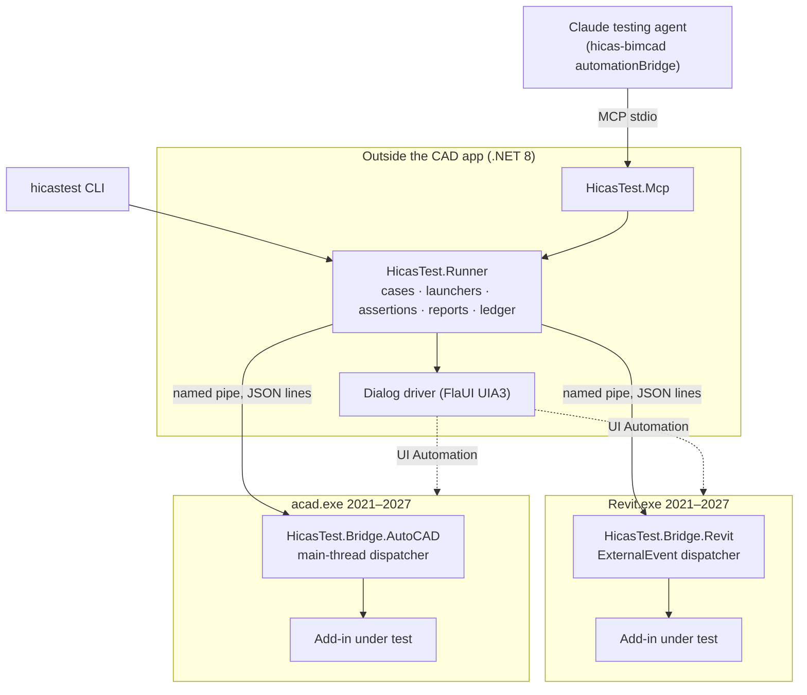

# Architecture

Goal: run the level-B cases of a hicas-bimcad test contract inside real Revit / AutoCAD, record what
happened, compare it with the expected values and export evidence for a human to confirm.
See [accuracy-study.md](accuracy-study.md) for how results are used today.



## Projects

| Project | Target | Role |
|---|---|---|
| `HicasTest.Protocol` | netstandard2.0, no dependencies | Wire DTOs and method names shared by bridge and runner |
| `HicasTest.Bridge.Core` | net48; net8.0 | Pipe server, router, discovery file, change log, filter evaluator, service invoker. No host API |
| `HicasTest.Bridge.Revit` | net48 (2021–2024) / net8.0-windows (2025–2026) / net10.0-windows (2027) | Revit adapter: `IExternalApplication`, `ExternalEvent` dispatcher, `DocumentChanged`, `FailuresProcessing`, `DialogBoxShowing`, `PostCommand`, queries, image export |
| `HicasTest.Bridge.AutoCAD` | net48 (2021–2024) / net8.0-windows (2025–2026) / net10.0-windows (2027) | AutoCAD adapter: `IExtensionApplication`, main-thread dispatcher, `Database` object events, `SendStringToExecute` + `CommandEnded`, queries |
| `HicasTest.Runner` | net8.0-windows | YAML cases, launchers, bridge client, FlaUI dialog driver, assertion engine, reports, ledger |
| `HicasTest.Cli` | net8.0-windows | `hicastest run / validate / bridges` |
| `HicasTest.Mcp` | net8.0-windows | MCP server (stdio) exposing the runner to agents |

## Key design decisions

1. **Bridge inside the host, everything else outside.** Revit and AutoCAD only allow API calls on
   their main thread inside their own process. The bridge is the only code that touches the host API;
   it marshals each request onto the main thread (Revit: `ExternalEvent`; AutoCAD: a hidden WinForms
   control's `BeginInvoke`, i.e. application context).
2. **Bridge has no third-party dependencies.** It shares the process with the add-in under test.
   A different Newtonsoft/System.Text.Json/Nice3point.Toolkit version in the bridge could break the
   add-in (Revit 2025+ does not isolate add-ins). JSON on the bridge side uses the in-box
   `DataContractJsonSerializer`.
3. **Every host year 2021–2027 is a separate bridge build.** `build\HostVersions.props` maps each year to
   its runtime (net48 / net8 / net10) and a pinned API reference package: `Nice3point.Revit.Api.*` for Revit,
   Autodesk's `AutoCAD.NET` for AutoCAD (Nice3point has no AutoCAD packages). Pick a year with
   `-p:RevitVersion=` / `-p:AutoCADVersion=`; output goes to `bin/R<year>/` or `bin/A<year>/`, and
   `build.ps1` copies it to `artifacts/bridges/<host>/<year>/`. Year-specific API differences use
   `REVIT2024_OR_GREATER`-style symbols (e.g. `ElementIds` for `ElementId.Value` vs `IntegerValue`).
   The runner picks the bridge from the case's `host.version` or `--host-version`.
4. **One fresh host process per case run.** Copies the fixture to a work folder, loads the lane's
   build, kills the process at the end. Matches the plugin rule "one lane per host process" and the
   fact that AutoCAD cannot unload assemblies.
5. **Facts, not pictures.** Verdicts come from recorded element changes and parameter values. Images
   are evidence for the human only.
6. **Tool verdicts are not plugin statuses.** `MATCH / MISMATCH / NOT-RUN / ERROR`, never Pass.

## Wire protocol

One JSON object per line over the named pipe `hicastest-<host>-<pid>`. A discovery file
`%LOCALAPPDATA%\HicasTest\bridges\<pid>.json` (a `BridgeInfo`) announces each running bridge.

```
→ {"id":3,"method":"command.run","payload":"{\"mode\":\"postcommand\",\"command\":\"...\"}"}
← {"id":3,"ok":true,"payload":"{\"status\":\"completed\",\"durationMs\":5123}","error":null}
```

Methods (`HicasTest.Protocol.Methods`): `bridge.info`, `doc.open`, `doc.close`, `recorder.start`,
`recorder.stop`, `command.run`, `elements.query`, `view.exportImage`, `dialogs.setRules`,
`dialogs.take`.

## One case run

1. Load YAML, validate (every value check must cite its oracle `source`).
2. Copy the fixture to `out/<case>/<stamp>-r<n>/`.
3. Launch the host with the bridge and the add-in under test (Revit: temporary `.addin` manifests;
   AutoCAD: startup script with `NETLOAD`). Startup security dialogs → "Load once" via FlaUI. The host is
   started through the shell so it does not inherit the MCP server's stdout. If startup fails the host is killed.
4. Wait for the discovery file, connect.
5. `dialogs.setRules` → `doc.open` → `recorder.start` → `command.run` (FlaUI watches dialogs meanwhile)
   → `recorder.stop` → `dialogs.take`. Case rules come first; `OpenModelDialogs` adds the answers needed to open a
   fixture (Revit unresolved references → ignore and continue; model warnings with 0 errors → OK, pressed from
   outside because overriding that dialog through the API cancels the open).

The FlaUI dialog driver (`DialogDriver`, `HostWindows`) lists windows with Win32 `EnumWindows`: UI Automation nests
an owned dialog under its owner, so a desktop-children scan misses Revit's startup dialog. Task dialog command
buttons (`CCPushButton`) and Revit's Win32 buttons are exposed as Pane without patterns; they are matched by class
and pressed with `WM_COMMAND` (Win32) or Invoke / LegacyIAccessible, falling back to a mouse click.
6. Evaluate expectations (`elements.query` where needed), export image.
7. Kill the host, remove temporary manifests, write `result.json`, `report.md`, ledger row.

## Command modes

| Mode | Host | How | Use when |
|---|---|---|---|
| `postcommand` | Revit | `RevitCommandId.LookupCommandId` + `UIApplication.PostCommand`; finished when Revit is idle again | Testing the real ribbon button |
| `commandline` | AutoCAD | `SendStringToExecute`, finished on `CommandEnded/Cancelled/Failed` of that command; extra tokens answer prompts | Testing the real command |
| `invoke` | both | Reflection call of a public static method `(UIApplication|Document host, string argument) → string` in the add-in | The command is blocked by UI; call the use case behind it |

## QA sessions (interactive)

`HicasTest.Runner.Sessions.QaSession`, exposed as MCP `qa_session_*` tools. One host process per session on a
fixture copy. Every action is a numbered step with a detail text and a window screenshot (`UiDriver`, FlaUI screen
capture of the main window, so dialogs on top are included). `run_command` with `wait=false` returns as soon as
the command starts, so Claude can drive its dialog with `qa_session_ui/click/type` and then
`qa_session_finish_command` collects changes and dialogs. Revit answers UI Automation slowly (one search of the
main window: ~20 s on 2024, ~55 s on 2026), so `UiDriver` uses a 90 s transaction timeout, cached properties and
one retry when the host is busy. While a command is pending the bridge pipe is busy:
queries are refused until it finishes. `qa_session_end` writes `sessions/<id>/report.md`. Sessions give evidence,
never a verdict.

## Running on other machines

- `build.ps1 -Package` → self-contained zip (CLI, MCP server, all bridges, docs, `install.ps1`). No .NET needed on
  the target.
- Bridges are found via `HICASTEST_BRIDGES` → `config.json` → `bridges\` next to the exe → `artifacts\bridges`.
- `MachineConfig` (`%LOCALAPPDATA%\HicasTest\config.json`): host exe paths per year, Revit `/language`, output dir.

## Open risks to verify in the first spike

- Revit: posted command completion detection by idle ticks (`RevitHostOperations.OnIdling`).
- Revit: `OpenAndActivateDocument` from an `ExternalEvent` on 2024 and 2026.
- Revit: closing the active document is not allowed by the API → the runner kills the process instead.
- AutoCAD: `Document.Open` and `SendStringToExecute` from the hidden-control dispatcher (application context).
- AutoCAD: image export is not implemented yet (`view.exportImage` returns an error).
- Startup dialogs (unsigned add-in, licensing, "What's new") per host version.
