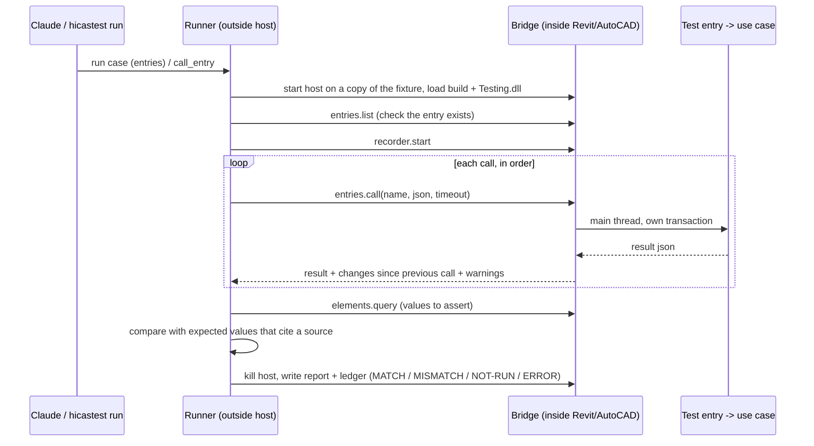

# Test entries — testing feature logic and flows without a person or a UI

Status: **implemented** (tool side: Contracts, protocol 2, `run.mode: entries`, MCP tools `list_entries` / `call_entry` / `qa_session_*_entry`);
verified live on Revit 2024 with `samples/SampleEntries`. AutoCAD builds and is not run live yet; the pilot on a real
add-in feature is pending. Replaces the "Claude drives the desktop" idea for level-B cases
(the UI-flow experiments are parked on branch `wip/ui-flows`).

## Scope

- In: the **logic and flow** of a feature — what the use case creates, changes or deletes in the model, the values it
  writes, the warnings it raises, and sequences of several calls where one call's result feeds the next.
- Out: UI. Dialogs, ribbon wiring and pick prompts are covered by the add-in's own unit tests (view models) and
  by people. Nobody has to operate Revit/AutoCAD while a case runs.

## Idea

Every feature exposes one or more **test entries**: public static methods in a **test assembly** of the add-in
that take a JSON request, call the *same use case the ribbon command calls*, and return a JSON result.
HicasTest discovers them and offers two generic tools, so Claude never needs a per-feature MCP server:

```
list_entries                      -> names, descriptions, contract file of every entry in the build under test
call_entry(name, argument-json)   -> result json + recorded model changes + warnings
```

A request DTO is exactly what the feature's dialog would produce, so the test supplies it directly.

There are two gates per feature:

- **Main gate** `feature.action` — the whole use case, the same call the ribbon command makes.
- **Step gates** (secondary) `feature.action.validate`, `.plan` (read-only dry runs) and `.apply` — the small
  methods the use case is built from, so an agent can see the warnings and the plan without writing, and test a
  branch cheaply.

## Rules for add-ins (the standard for every project)

The full convention is in the plugin: `hicas-bimcad` skill `addin-story`, `references/test-entries.md`.

1. **Small methods.** A use case is `Validate → Plan → Apply` behind `Execute`; each step takes and returns DTOs,
   `Validate`/most of `Plan` are pure, only `Apply` and the snapshot read touch the host.
2. **Warnings are data.** The use case reports warnings and asks confirmations through `IUserPrompt` (stable id,
   severity, options, default) and never opens a window or a `TaskDialog`. Tests use a recording implementation
   answered from a script.
3. **Ribbon command = thin adapter:** show the dialog, build the request, call the use case, show the result.
4. **Test entries** (in `<Addin>.Testing.dll`, never shipped; main gate and step gates):

   ```csharp
   public static class KeyplanEntries
   {
       [HicasTestEntry("keyplan.create", Description = "Create a keyplan view", Contract = "docs/specs/test-entries/keyplan.create.yaml")]
       public static string Create(UIApplication app, string requestJson)
       {
           var request = Json.Parse<CreateKeyplanRequest>(requestJson);
           var result = new CreateKeyplanService().Execute(app.ActiveUIDocument.Document, request, TestPrompt.Current);
           return Json.Write(result);
       }

       [HicasTestEntry("keyplan.create.plan", ReadOnly = true)]
       public static string Plan(UIApplication app, string requestJson) => /* Plan(...) as JSON */;
   }
   ```

   Parameters are bound like `invoke` mode today: the host context by type, plus one `string` argument.
5. **Contract file** per entry: request fields with units, result fields, and example values. addin-story writes it
   with the task, and the test contract's expected values refer to it.
6. `HicasTest.TestMode.IsActive` (environment variable `HICASTEST_MODE=1`, set by the launcher) lets code choose
   headless services; production never sees it set.

The attribute lives in a tiny dependency-free `HicasTest.Contracts` assembly (netstandard2.0). Discovery matches the
attribute by full name, so a project does not have to track the tool's version.

## Warnings and prompts in the main flow

A feature may warn or ask in the middle of its flow ("name exists, overwrite?", "3 elements skipped"). Two kinds are
recorded separately for every call:

| Kind | Source | Where it shows up |
|---|---|---|
| **Prompts** raised by the feature | `IUserPrompt` (`TestPrompt.Current` in an entry) | `prompts` of the call result: id, severity, message, options, answer, `unanswered` flag |
| **Host warnings** | Revit `FailuresProcessing` (recorded by the bridge as today) | `warnings` of the call |

The agent decides the answers: `call_entry(name, request, answers=[{id, option}])`. An unanswered prompt takes its
default and is flagged, so the agent learns which prompts a flow needs; a case can then cover each branch
("continue", "cancel") separately. `validate` lists the prompts the flow would raise without writing anything.
`HicasTest.Contracts` provides the ambient `TestContext` (answers in, prompt records out) that the add-in's test
implementation of `IUserPrompt` uses; answers cross the wire as a list, not a dictionary.

## Flow



## Case format (extension of `docs/test-case-format.md`)

```yaml
run:
  mode: entries
  assembly: ../../src/MyAddin.Testing/bin/Debug/R2024/MyAddin.Testing.dll
  timeoutSec: 120            # whole case
calls:
  - id: make
    entry: keyplan.create
    argument: { level: "Level 1", scale: 100 }          # or argumentFile: requests/make.json
    answers: []                                           # prompt id -> option; none = every prompt takes its default
    expectResult:                                         # checks on the returned JSON, dotted path
      - { path: viewName, equals: "KP - Level 1", source: "ticket #1234 AC-02" }
    expectPrompts:                                        # prompts the flow must (not) raise
      - { id: "keyplan.duplicate-name", raised: false, source: "ticket #1234 AC-02: first run has no duplicate" }
    expect:                                               # model changes since the previous call
      - { kind: added, category: OST_Views, count: 1, source: "ticket #1234 AC-02" }
  - id: again
    entry: keyplan.create
    argument: { level: "Level 1", scale: 100 }
    answers: [ { id: "keyplan.duplicate-name", option: "cancel" } ]
    expectPrompts:
      - { id: "keyplan.duplicate-name", raised: true, severity: confirm, source: "ticket #1234 AC-05: duplicate name asks first" }
    expectResult:
      - { path: status, equals: "cancelled", source: "ticket #1234 AC-05: cancel leaves the model unchanged" }
    expect:
      - { kind: added, count: 0, source: "ticket #1234 AC-05" }
expect:                                                   # whole case, existing kinds
  - { kind: no-warnings }
```

Same rules as today: every value check cites an independent `source`; verdicts are only
`MATCH / MISMATCH / NOT-RUN / ERROR`; never Pass.

## What guards against a hung host

A modal dialog stops the host's main thread, and the bridge lives in that thread, so the guard must be outside it.

| Layer | What it does |
|---|---|
| Entries have no UI | rules 2 and 6 above (prompts are data) |
| Window watch in the runner (`DialogDriver`, every 0.5 s) | a window nobody expects → screenshot, record title and buttons, case `ERROR: unexpected dialog`, kill host. It never guesses an answer |
| Known dialogs | Revit TaskDialogs answered by the bridge, other windows by rules in the case (as today) |
| Timeouts | per call and per case; on expiry the host is killed |
| Wrong build | an assembly the test build ships is already loaded from another folder (dev manifest, installed copy): `entries.list` / `entries.call` report it, and an entries case ends `ERROR` instead of testing other code |

## Security

- Entries exist only in `*.Testing.dll`, which is not part of any installer; the add-in itself exposes nothing.
- The bridge loads only assemblies named by the runner from the build under test; the pipe is local.
- Entries run only in hosts HicasTest started, on a copy of a test resource, never in a user's Revit.

## Protocol and tools to add

| Where | Addition |
|---|---|
| `HicasTest.Protocol` | `entries.list` (name, kind main/step, read-only, contract path, prompt ids), `entries.call` (name, argument, answers list → result, prompts, per-call changes, warnings); protocol version 2 |
| `HicasTest.Bridge.Core` | reflection discovery by attribute name; `ServiceInvoker` reuse; per-call change snapshot |
| `HicasTest.Runner` | `run.mode: entries`, `calls:`, `answers`, `expectResult` (JSON path), `expectPrompts`, report section per call |
| `HicasTest.Mcp` | `list_entries`, `call_entry(name, argument, answers)` (running bridge) and `qa_session_list_entries`, `qa_session_call_entry`; step gates are called with the same tool |
| `HicasTest.Contracts` | `[HicasTestEntry]`, `TestMode`, ambient `TestContext` for answers/prompt records (netstandard2.0, no dependencies; same rules as the bridge) |
| Plugin `hicas-bimcad` 1.4.0 (done) | addin-story convention and templates (small steps, `IUserPrompt`, main + step gates, contract file), reviewer/evaluator checks, b-auto-run `entries` section (active once `list_entries` exists), `b-desktop-test` parked |

## Limits

- A test entry proves the use case, not that the button calls it. The thin-adapter rule and the evaluator line
  reduce that gap; they do not remove it.
- Features that are mostly interaction (freehand drawing, drag) have no meaningful entry; those stay with people.
- Entry and command can drift. Reviewing both in the same diff is the control.

## First pilot (done on a real add-in function, Revit 2024)

An entry pair (`.plan`, main) around an existing static use case (crop-box fitting of a view), built into the add-in's output folder
with `HicasTest.Contracts.dll`, run by `run_test_case` and through the MCP server:

- plan → shrink → shrink again → unknown view ran in one host start (~20 s, calls 3–530 ms); the numbers matched the function's
  documented behaviour exactly (content + 2 × padding + the 1000 mm extension).
- It found things a command-level test would not show: the "measure" function writes (hides scope boxes) so its `.plan` entry must
  roll back a transaction; a wrong fixture (no MEP content) was reported as MISMATCH, not hidden; the second shrink reports "shrunk"
  although the box is unchanged.
- The wrong-build guard stopped a run whose test assembly sat in another folder while a dev manifest had loaded the main build.

## Pilot (next)

One real feature of one add-in, Revit 2024: write the entry and contract, run two cases (one MATCH, one against a
deliberately broken build for MISMATCH), measure setup time. Decide on the rollout after that.
